# SIAKAD PRO — Mermaid Architecture Charts

## 1. Arsitektur Sistem (High-Level)

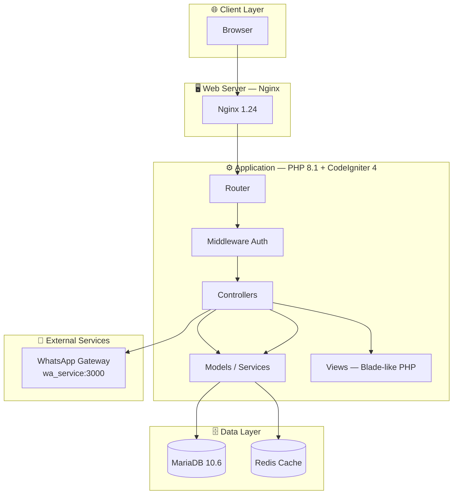
```mermaid
graph TB
    subgraph Client["🌐 Client Layer"]
        B[Browser]
    end

    subgraph Web["🖥️ Web Server — Nginx"]
        N[Nginx 1.24]
    end

    subgraph App["⚙️ Application — PHP 8.1 + CodeIgniter 4"]
        R[Router]
        MW[Middleware Auth]
        C[Controllers]
        M[Models / Services]
        V[Views — Blade-like PHP]
    end

    subgraph Data["🗄️ Data Layer"]
        DB[(MariaDB 10.6)]
        RD[(Redis Cache)]
    end

    subgraph Ext["📡 External Services"]
        WA[WhatsApp Gateway\nwa_service:3000]
    end

    B --> N --> R --> MW --> C --> V
    C --> M --> DB
    C --> M --> RD
    C --> WA
```

---

## 2. Struktur Modul & Menu

```mermaid
graph LR
    ROOT[SIAKAD PRO]

    ROOT --> MASTER[Master Data]
    ROOT --> PPDB[PPDB Online]
    ROOT --> KESISWAAN[Kesiswaan]
    ROOT --> AKADEMIK[Akademik]
    ROOT --> PESANTREN[Kepesantrenan]
    ROOT --> KEUANGAN[Keuangan]
    ROOT --> KEPEGAWAIAN[Kepegawaian]
    ROOT --> EKSKUL[Ekstrakurikuler]
    ROOT --> AREA[Area Saya]
    ROOT --> SETTINGS[Pengaturan]

    MASTER --> M1[Identitas Sekolah]
    MASTER --> M2[Tahun Ajaran]
    MASTER --> M3[Data Kelas]
    MASTER --> M4[Mata Pelajaran]
    MASTER --> M5[Bobot Penilaian]
    MASTER --> M6[Kalender Akademik]

    PPDB --> P1[Data Pendaftar]
    PPDB --> P2[Atur Jalur]
    PPDB --> P3[Atur Periode]
    PPDB --> P4[Konfigurasi]

    KESISWAAN --> K1[Data Siswa]
    KESISWAAN --> K2[Data Wali Murid]
    KESISWAAN --> K3[Absensi Siswa]
    KESISWAAN --> K4[Prestasi]
    KESISWAAN --> K5[Konseling BK]
    KESISWAAN --> K6[Pelanggaran Siswa]
    KESISWAAN --> K7[Pelacakan Santri]
    KESISWAAN --> K8[Laporan Wali Kelas]
    KESISWAAN --> K9[Poskestren]
    KESISWAAN --> K10[Perpustakaan]

    AKADEMIK --> A1[Jadwal Pelajaran]
    AKADEMIK --> A2[Jurnal Mengajar]
    AKADEMIK --> A3[Input Nilai]
    AKADEMIK --> A4[Bank Soal]
    AKADEMIK --> A5[Kenaikan Kelas]
    AKADEMIK --> A6[Set Wali Kelas]
    AKADEMIK --> A7[Dispensasi KBM]
    AKADEMIK --> A8[Cetak Rapor]
    AKADEMIK --> A9[Silabus & RPP]
    AKADEMIK --> A10[Kurikulum]
    AKADEMIK --> A11[SK Mengajar]

    PESANTREN --> PS1[Data Asrama]
    PESANTREN --> PS2[Wali Asrama]
    PESANTREN --> PS3[Kesehatan]
    PESANTREN --> PS4[Perizinan]
    PESANTREN --> PS5[Jadwal Kegiatan]
    PESANTREN --> PS6[Tahfidz]
    PESANTREN --> PS7[Jurnal Kitab]
    PESANTREN --> PS8[Mutasi Kamar]
    PESANTREN --> PS9[Rapor Asrama]

    KEUANGAN --> KU1[Kasir / Pembayaran]
    KEUANGAN --> KU2[Jenis Tagihan]
    KEUANGAN --> KU3[Laporan Keuangan]
    KEUANGAN --> KU4[Inventaris Aset]
    KEUANGAN --> KU5[Data SPP]
    KEUANGAN --> KU6[Laporan Bendahara]

    KEPEGAWAIAN --> KP1[Master Jabatan]
    KEPEGAWAIAN --> KP2[Data Staff]
    KEPEGAWAIAN --> KP3[Struktur Organisasi]
    KEPEGAWAIAN --> KP4[Data Guru]
    KEPEGAWAIAN --> KP5[Alumni]
    KEPEGAWAIAN --> KP6[Absensi Pegawai]

    EKSKUL --> E1[Data & Jadwal]
    EKSKUL --> E2[Anggota Ekskul]
    EKSKUL --> E3[Absensi Ekskul]
    EKSKUL --> E4[Rapor Ekstrakurikuler]

    AREA --> AR1[Kelas Saya - Wali]
    AREA --> AR2[Pengumuman]
    AREA --> AR3[Tiket Bantuan]

    SETTINGS --> S1[WhatsApp API]
    SETTINGS --> S2[Manajemen Menu]
    SETTINGS --> S3[Template Surat]
    SETTINGS --> S4[Manajemen Role]
```

---

## 3. Alur Autentikasi & Role

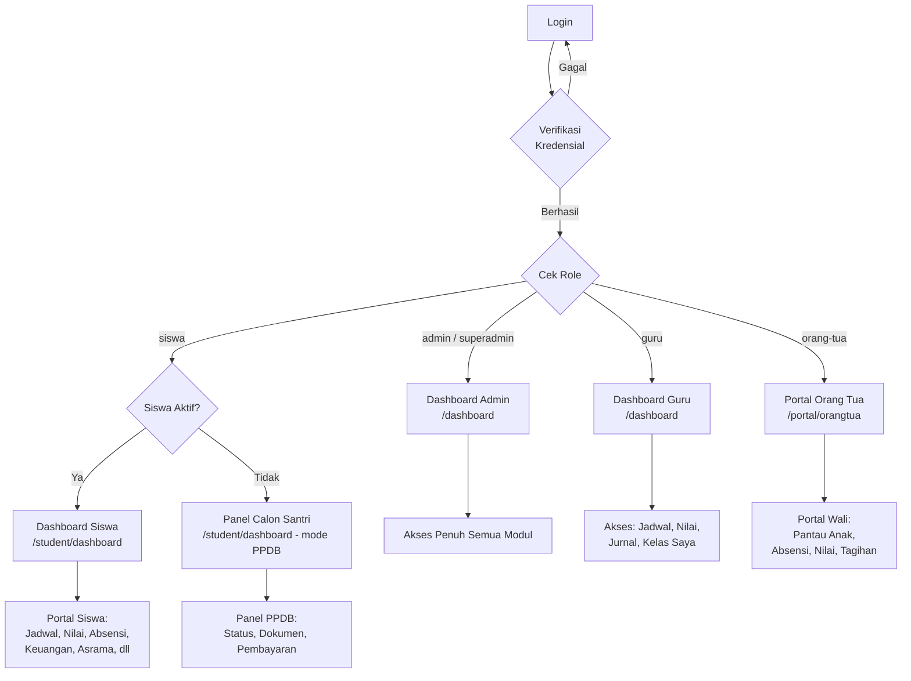
```mermaid
flowchart TD
    LOGIN[Login] --> AUTH{Verifikasi\nKredensial}
    AUTH -- Gagal --> LOGIN
    AUTH -- Berhasil --> ROLE{Cek Role}

    ROLE -- admin / superadmin --> ADMIN[Dashboard Admin\n/dashboard]
    ROLE -- guru --> GURU[Dashboard Guru\n/dashboard]
    ROLE -- siswa --> CEK{Siswa Aktif?}
    ROLE -- orang-tua --> PARENT[Portal Orang Tua\n/portal/orangtua]

    CEK -- Ya --> STUDENT[Dashboard Siswa\n/student/dashboard]
    CEK -- Tidak --> CALON[Panel Calon Santri\n/student/dashboard - mode PPDB]

    ADMIN --> FULL[Akses Penuh Semua Modul]
    GURU --> LIMITED[Akses: Jadwal, Nilai,\nJurnal, Kelas Saya]
    STUDENT --> PORTAL[Portal Siswa:\nJadwal, Nilai, Absensi,\nKeuangan, Asrama, dll]
    PARENT --> PORTALP[Portal Wali:\nPantau Anak,\nAbsensi, Nilai, Tagihan]
    CALON --> PPDBP[Panel PPDB:\nStatus, Dokumen, Pembayaran]
```

---

## 4. Alur PPDB (Penerimaan Peserta Didik Baru)

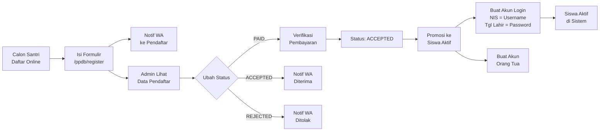
```mermaid
flowchart LR
    REG[Calon Santri\nDaftar Online] --> FORM[Isi Formulir\n/ppdb/register]
    FORM --> NOTIF[Notif WA\nke Pendaftar]
    FORM --> ADMIN_VIEW[Admin Lihat\nData Pendaftar]

    ADMIN_VIEW --> STATUS{Ubah Status}
    STATUS -- PAID --> VERIFY[Verifikasi\nPembayaran]
    STATUS -- ACCEPTED --> WA_ACC[Notif WA\nDiterima]
    STATUS -- REJECTED --> WA_REJ[Notif WA\nDitolak]

    VERIFY --> ACCEPTED[Status: ACCEPTED]
    ACCEPTED --> PROMOTE[Promosi ke\nSiswa Aktif]
    PROMOTE --> CREATE_USER[Buat Akun Login\nNIS = Username\nTgl Lahir = Password]
    PROMOTE --> CREATE_PARENT[Buat Akun\nOrang Tua]
    CREATE_USER --> STUDENT_ACTIVE[Siswa Aktif\ndi Sistem]
```

---

## 5. Alur Keuangan

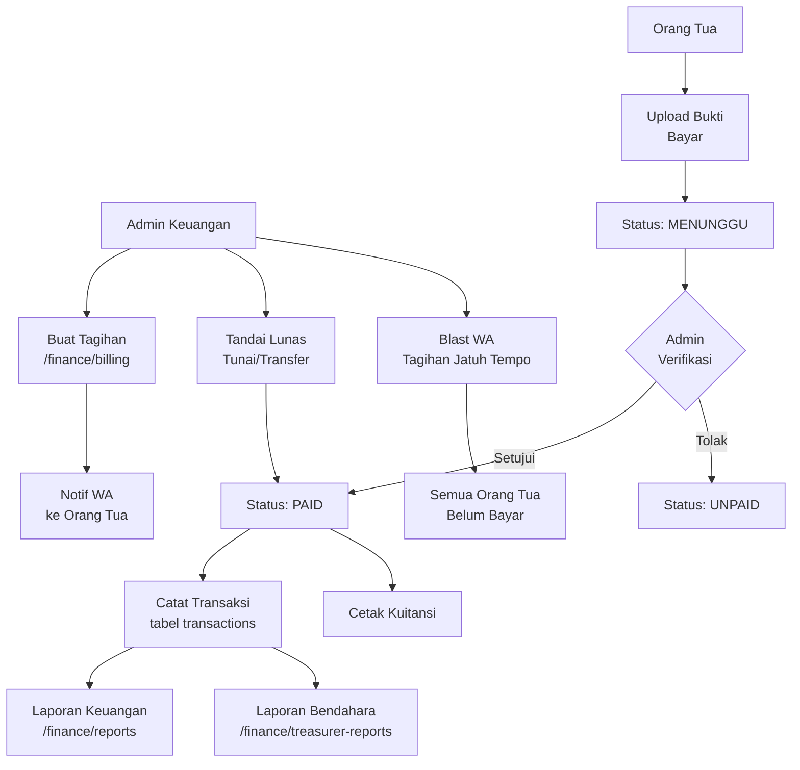
```mermaid
flowchart TD
    ADMIN_FIN[Admin Keuangan] --> CREATE_BILL[Buat Tagihan\n/finance/billing]
    CREATE_BILL --> WA_NOTIF[Notif WA\nke Orang Tua]

    PARENT_PORTAL[Orang Tua] --> UPLOAD[Upload Bukti\nBayar]
    UPLOAD --> PENDING[Status: MENUNGGU]
    PENDING --> VERIFY{Admin\nVerifikasi}
    VERIFY -- Setujui --> PAID[Status: PAID]
    VERIFY -- Tolak --> UNPAID[Status: UNPAID]

    ADMIN_FIN --> CASH[Tandai Lunas\nTunai/Transfer]
    CASH --> PAID

    PAID --> TRX[Catat Transaksi\ntabel transactions]
    PAID --> RECEIPT[Cetak Kuitansi]

    ADMIN_FIN --> BLAST[Blast WA\nTagihan Jatuh Tempo]
    BLAST --> PARENTS_ALL[Semua Orang Tua\nBelum Bayar]

    TRX --> REPORT[Laporan Keuangan\n/finance/reports]
    TRX --> TREASURER[Laporan Bendahara\n/finance/treasurer-reports]
```

---

## 6. Alur Notifikasi WhatsApp

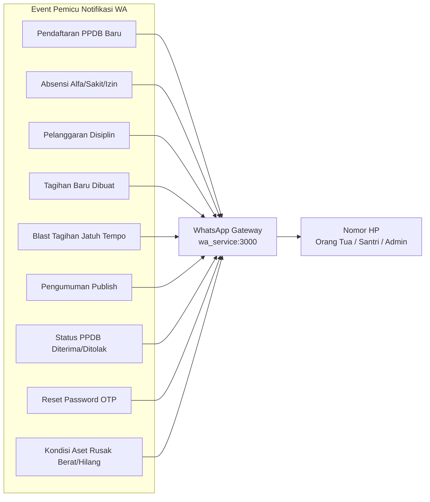
```mermaid
flowchart LR
    WA_SVC[WhatsApp Gateway\nwa_service:3000]

    subgraph Triggers["Event Pemicu Notifikasi WA"]
        T1[Pendaftaran PPDB Baru]
        T2[Absensi Alfa/Sakit/Izin]
        T3[Pelanggaran Disiplin]
        T4[Tagihan Baru Dibuat]
        T5[Blast Tagihan Jatuh Tempo]
        T6[Pengumuman Publish]
        T7[Status PPDB Diterima/Ditolak]
        T8[Reset Password OTP]
        T9[Kondisi Aset Rusak Berat/Hilang]
    end

    T1 --> WA_SVC
    T2 --> WA_SVC
    T3 --> WA_SVC
    T4 --> WA_SVC
    T5 --> WA_SVC
    T6 --> WA_SVC
    T7 --> WA_SVC
    T8 --> WA_SVC
    T9 --> WA_SVC

    WA_SVC --> PHONE[Nomor HP\nOrang Tua / Santri / Admin]
```

---

## 7. Relasi Tabel Database (Inti)

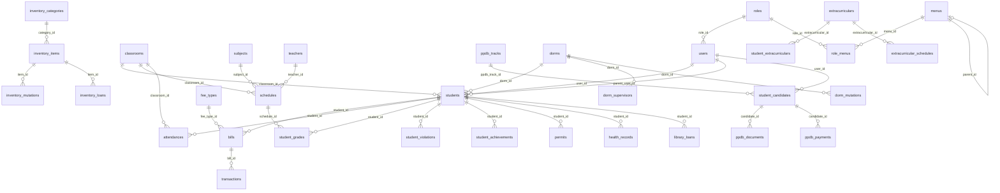
```mermaid
erDiagram
    users ||--o{ students : "user_id"
    users ||--o{ students : "parent_user_id"
    users ||--o{ student_candidates : "user_id"

    classrooms ||--o{ students : "classroom_id"
    classrooms ||--o{ schedules : "classroom_id"
    classrooms ||--o{ attendances : "classroom_id"

    students ||--o{ bills : "student_id"
    students ||--o{ attendances : "student_id"
    students ||--o{ student_grades : "student_id"
    students ||--o{ student_violations : "student_id"
    students ||--o{ student_achievements : "student_id"
    students ||--o{ permits : "student_id"
    students ||--o{ health_records : "student_id"
    students ||--o{ library_loans : "student_id"

    bills ||--o{ transactions : "bill_id"
    fee_types ||--o{ bills : "fee_type_id"

    subjects ||--o{ schedules : "subject_id"
    teachers ||--o{ schedules : "teacher_id"
    schedules ||--o{ student_grades : "schedule_id"

    student_candidates ||--o{ ppdb_documents : "candidate_id"
    student_candidates ||--o{ ppdb_payments : "candidate_id"
    ppdb_tracks ||--o{ student_candidates : "ppdb_track_id"

    dorms ||--o{ students : "dorm_id"
    dorms ||--o{ dorm_supervisors : "dorm_id"
    dorms ||--o{ dorm_mutations : "dorm_id"

    inventory_categories ||--o{ inventory_items : "category_id"
    inventory_items ||--o{ inventory_mutations : "item_id"
    inventory_items ||--o{ inventory_loans : "item_id"

    extracurriculars ||--o{ student_extracurriculars : "extracurricular_id"
    extracurriculars ||--o{ extracurricular_schedules : "extracurricular_id"

    roles ||--o{ users : "role_id"
    roles ||--o{ role_menus : "role_id"
    menus ||--o{ role_menus : "menu_id"
    menus ||--o| menus : "parent_id"
```

---

## 8. Portal Pengguna

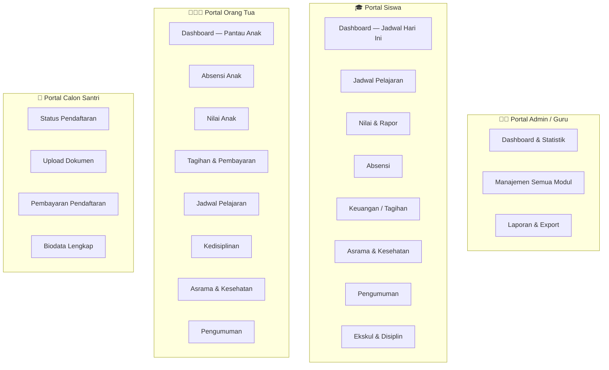
```mermaid
graph TB
    subgraph ADMIN_PORTAL["👨‍💼 Portal Admin / Guru"]
        AD1[Dashboard & Statistik]
        AD2[Manajemen Semua Modul]
        AD3[Laporan & Export]
    end

    subgraph STUDENT_PORTAL["🎓 Portal Siswa"]
        SP1[Dashboard — Jadwal Hari Ini]
        SP2[Jadwal Pelajaran]
        SP3[Nilai & Rapor]
        SP4[Absensi]
        SP5[Keuangan / Tagihan]
        SP6[Asrama & Kesehatan]
        SP7[Pengumuman]
        SP8[Ekskul & Disiplin]
    end

    subgraph PARENT_PORTAL["👨‍👩‍👧 Portal Orang Tua"]
        PP1[Dashboard — Pantau Anak]
        PP2[Absensi Anak]
        PP3[Nilai Anak]
        PP4[Tagihan & Pembayaran]
        PP5[Jadwal Pelajaran]
        PP6[Kedisiplinan]
        PP7[Asrama & Kesehatan]
        PP8[Pengumuman]
    end

    subgraph PPDB_PORTAL["📝 Portal Calon Santri"]
        CP1[Status Pendaftaran]
        CP2[Upload Dokumen]
        CP3[Pembayaran Pendaftaran]
        CP4[Biodata Lengkap]
    end
```

---

## 9. Infrastruktur Docker

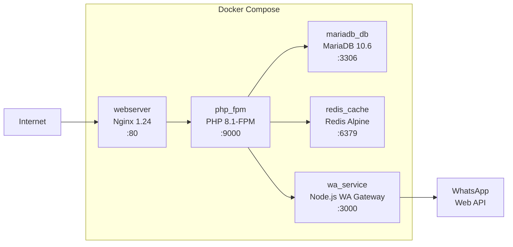
```mermaid
graph LR
    subgraph DOCKER["Docker Compose"]
        WEB[webserver\nNginx 1.24\n:80]
        PHP[php_fpm\nPHP 8.1-FPM\n:9000]
        DB[mariadb_db\nMariaDB 10.6\n:3306]
        CACHE[redis_cache\nRedis Alpine\n:6379]
        WA[wa_service\nNode.js WA Gateway\n:3000]
    end

    INTERNET[Internet] --> WEB
    WEB --> PHP
    PHP --> DB
    PHP --> CACHE
    PHP --> WA
    WA --> WHATSAPP[WhatsApp\nWeb API]
```

---

## 10. Flow Absensi Siswa

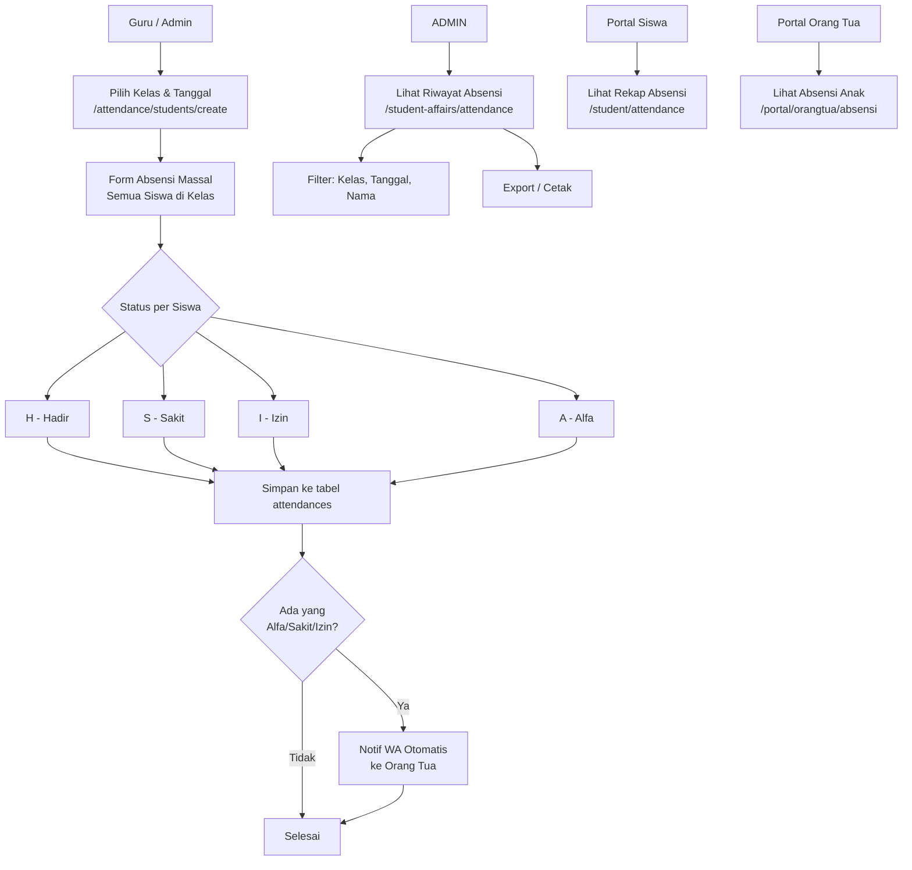
```mermaid
flowchart TD
    GURU[Guru / Admin] --> PILIH[Pilih Kelas & Tanggal\n/attendance/students/create]
    PILIH --> FORM[Form Absensi Massal\nSemua Siswa di Kelas]
    FORM --> STATUS{Status per Siswa}
    STATUS --> H[H - Hadir]
    STATUS --> S[S - Sakit]
    STATUS --> I[I - Izin]
    STATUS --> A[A - Alfa]
    H & S & I & A --> SAVE[Simpan ke tabel attendances]
    SAVE --> CEK{Ada yang\nAlfa/Sakit/Izin?}
    CEK -- Ya --> WA[Notif WA Otomatis\nke Orang Tua]
    CEK -- Tidak --> DONE[Selesai]
    WA --> DONE

    ADMIN --> REKAP[Lihat Riwayat Absensi\n/student-affairs/attendance]
    REKAP --> FILTER[Filter: Kelas, Tanggal, Nama]
    REKAP --> EXPORT[Export / Cetak]

    SISWA_PORTAL[Portal Siswa] --> CEK_ABS[Lihat Rekap Absensi\n/student/attendance]
    ORTU_PORTAL[Portal Orang Tua] --> CEK_ABS2[Lihat Absensi Anak\n/portal/orangtua/absensi]
```

---

## 11. Flow Input Nilai & Rapor

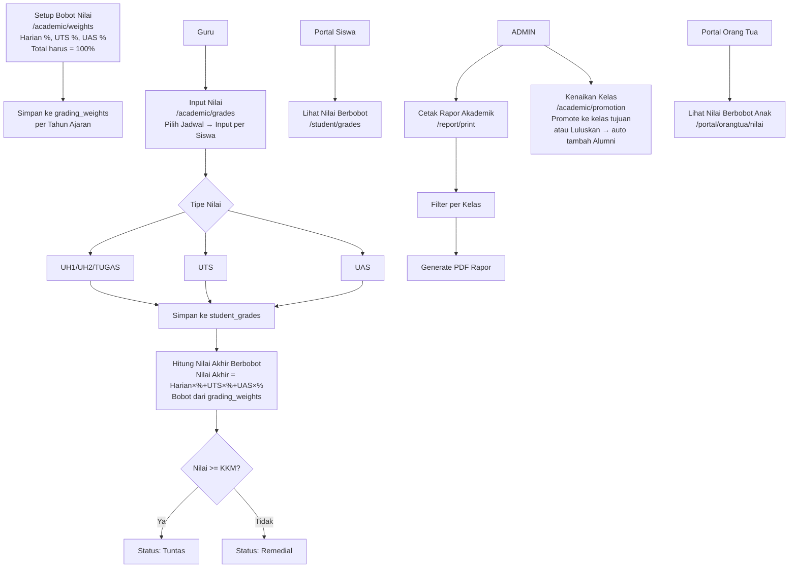
```mermaid
flowchart TD
    SETUP_BOBOT[Setup Bobot Nilai\n/academic/weights\nHarian %, UTS %, UAS %\nTotal harus = 100%]
    SETUP_BOBOT --> DB_WEIGHT[Simpan ke grading_weights\nper Tahun Ajaran]

    GURU[Guru] --> INPUT[Input Nilai\n/academic/grades\nPilih Jadwal → Input per Siswa]
    INPUT --> TIPE{Tipe Nilai}
    TIPE --> TUGAS[UH1/UH2/TUGAS]
    TIPE --> UTS[UTS]
    TIPE --> UAS[UAS]
    TUGAS & UTS & UAS --> DB_GRADE[Simpan ke student_grades]

    DB_GRADE --> HITUNG[Hitung Nilai Akhir Berbobot\nNilai Akhir = Harian×%+UTS×%+UAS×%\nBobot dari grading_weights]
    HITUNG --> KKM{Nilai >= KKM?}
    KKM -- Ya --> TUNTAS[Status: Tuntas]
    KKM -- Tidak --> REMEDIAL[Status: Remedial]

    ADMIN --> RAPOR[Cetak Rapor Akademik\n/report/print]
    RAPOR --> FILTER_KELAS[Filter per Kelas]
    FILTER_KELAS --> PRINT[Generate PDF Rapor]

    SISWA_PORTAL[Portal Siswa] --> LIHAT_NILAI[Lihat Nilai Berbobot\n/student/grades]
    ORTU_PORTAL[Portal Orang Tua] --> LIHAT_NILAI2[Lihat Nilai Berbobot Anak\n/portal/orangtua/nilai]

    ADMIN --> NAIK[Kenaikan Kelas\n/academic/promotion\nPromote ke kelas tujuan\natau Luluskan → auto tambah Alumni]
```

---

## 12. Flow Disiplin (Pelanggaran & Prestasi)

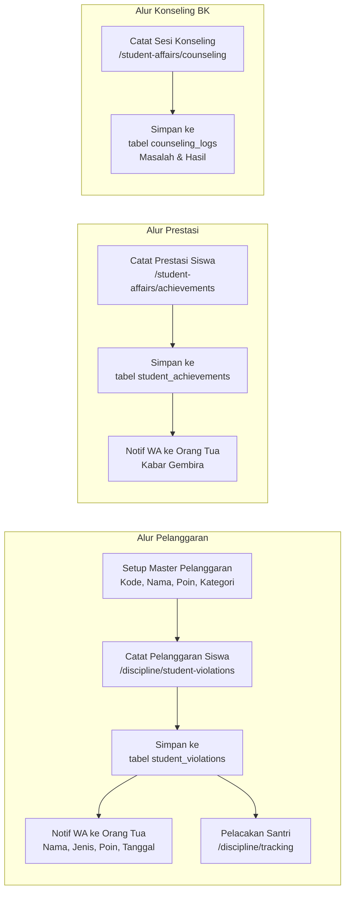
```mermaid
flowchart LR
    subgraph PELANGGARAN["Alur Pelanggaran"]
        MASTER_V[Setup Master Pelanggaran\nKode, Nama, Poin, Kategori]
        MASTER_V --> CATAT[Catat Pelanggaran Siswa\n/discipline/student-violations]
        CATAT --> SIMPAN_V[Simpan ke\ntabel student_violations]
        SIMPAN_V --> WA_V[Notif WA ke Orang Tua\nNama, Jenis, Poin, Tanggal]
        SIMPAN_V --> TRACKING[Pelacakan Santri\n/discipline/tracking]
    end

    subgraph PRESTASI["Alur Prestasi"]
        CATAT_P[Catat Prestasi Siswa\n/student-affairs/achievements]
        CATAT_P --> SIMPAN_P[Simpan ke\ntabel student_achievements]
        SIMPAN_P --> WA_P[Notif WA ke Orang Tua\nKabar Gembira]
    end

    subgraph KONSELING["Alur Konseling BK"]
        SESI[Catat Sesi Konseling\n/student-affairs/counseling]
        SESI --> LOG[Simpan ke\ntabel counseling_logs\nMasalah & Hasil]
    end
```

---

## 13. Flow Asrama (Boarding)

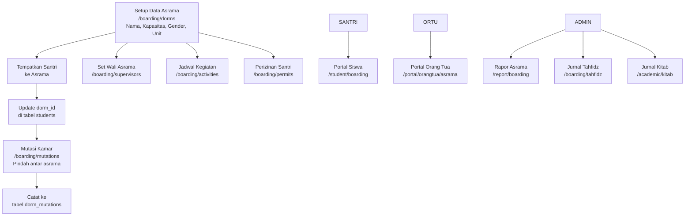
```mermaid
flowchart TD
    SETUP[Setup Data Asrama\n/boarding/dorms\nNama, Kapasitas, Gender, Unit]
    SETUP --> ASSIGN[Tempatkan Santri\nke Asrama]
    ASSIGN --> UPDATE_DORM[Update dorm_id\ndi tabel students]

    UPDATE_DORM --> MUTASI[Mutasi Kamar\n/boarding/mutations\nPindah antar asrama]
    MUTASI --> LOG_MUTASI[Catat ke\ntabel dorm_mutations]

    SETUP --> WALI[Set Wali Asrama\n/boarding/supervisors]
    SETUP --> KEGIATAN[Jadwal Kegiatan\n/boarding/activities]
    SETUP --> IZIN[Perizinan Santri\n/boarding/permits]

    SANTRI --> LIHAT_ASRAMA[Portal Siswa\n/student/boarding]
    ORTU --> LIHAT_ASRAMA2[Portal Orang Tua\n/portal/orangtua/asrama]

    ADMIN --> RAPOR_ASRAMA[Rapor Asrama\n/report/boarding]
    ADMIN --> TAHFIDZ[Jurnal Tahfidz\n/boarding/tahfidz]
    ADMIN --> KITAB[Jurnal Kitab\n/academic/kitab]
```

---

## 14. Flow Inventaris Aset

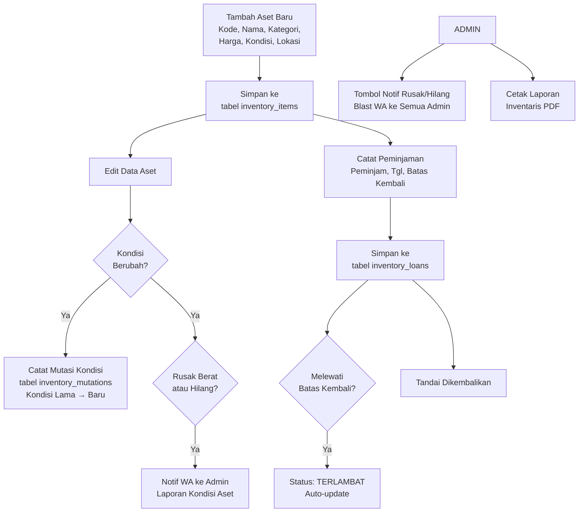
```mermaid
flowchart TD
    TAMBAH[Tambah Aset Baru\nKode, Nama, Kategori,\nHarga, Kondisi, Lokasi]
    TAMBAH --> DB_INV[Simpan ke\ntabel inventory_items]

    DB_INV --> EDIT[Edit Data Aset]
    EDIT --> CEK_KONDISI{Kondisi\nBerubah?}
    CEK_KONDISI -- Ya --> MUTASI[Catat Mutasi Kondisi\ntabel inventory_mutations\nKondisi Lama → Baru]
    CEK_KONDISI -- Ya --> CEK_RUSAK{Rusak Berat\natau Hilang?}
    CEK_RUSAK -- Ya --> WA_ADMIN[Notif WA ke Admin\nLaporan Kondisi Aset]

    DB_INV --> PINJAM[Catat Peminjaman\nPeminjam, Tgl, Batas Kembali]
    PINJAM --> DB_LOAN[Simpan ke\ntabel inventory_loans]
    DB_LOAN --> CEK_DUE{Melewati\nBatas Kembali?}
    CEK_DUE -- Ya --> TERLAMBAT[Status: TERLAMBAT\nAuto-update]
    DB_LOAN --> KEMBALI[Tandai Dikembalikan]

    ADMIN --> BLAST_RUSAK[Tombol Notif Rusak/Hilang\nBlast WA ke Semua Admin]
    ADMIN --> EXPORT_INV[Cetak Laporan\nInventaris PDF]
```

---

## 15. Flow Perpustakaan

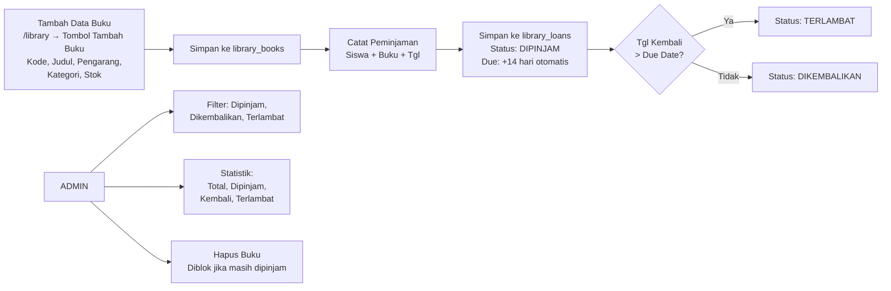
```mermaid
flowchart LR
    SETUP_BUKU[Tambah Data Buku\n/library → Tombol Tambah Buku\nKode, Judul, Pengarang,\nKategori, Stok]
    SETUP_BUKU --> DB_BOOK[Simpan ke library_books]
    DB_BOOK --> PINJAM[Catat Peminjaman\nSiswa + Buku + Tgl]
    PINJAM --> DB_LOAN[Simpan ke library_loans\nStatus: DIPINJAM\nDue: +14 hari otomatis]

    DB_LOAN --> CEK_KEMBALI{Tgl Kembali\n> Due Date?}
    CEK_KEMBALI -- Ya --> TERLAMBAT[Status: TERLAMBAT]
    CEK_KEMBALI -- Tidak --> KEMBALI[Status: DIKEMBALIKAN]

    ADMIN --> FILTER[Filter: Dipinjam,\nDikembalikan, Terlambat]
    ADMIN --> STATS[Statistik:\nTotal, Dipinjam,\nKembali, Terlambat]
    ADMIN --> DEL_BOOK[Hapus Buku\nDiblok jika masih dipinjam]
```

---

## 16. Flow Ekstrakurikuler

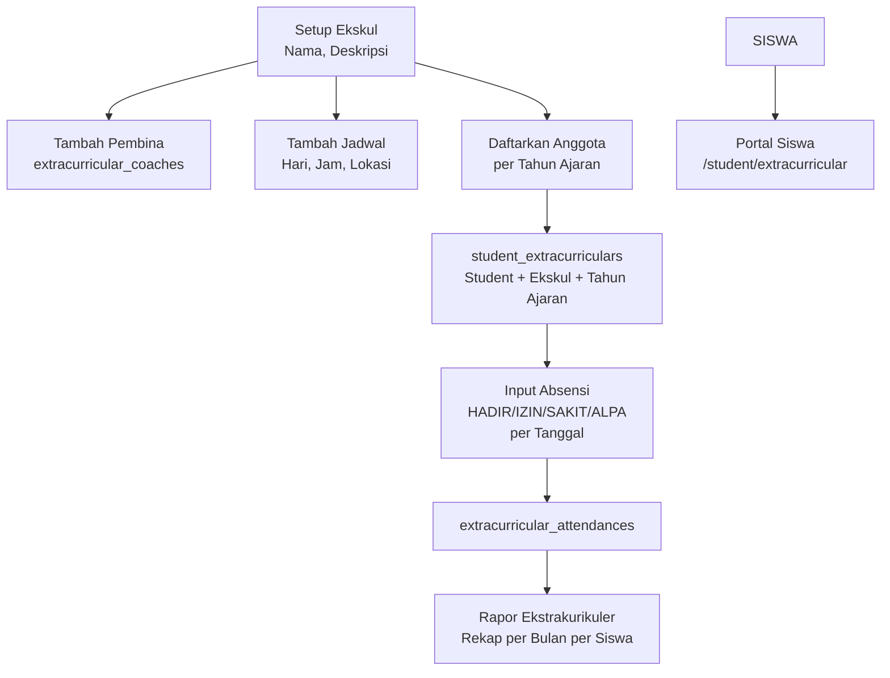
```mermaid
flowchart TD
    SETUP[Setup Ekskul\nNama, Deskripsi]
    SETUP --> PEMBINA[Tambah Pembina\nextracurricular_coaches]
    SETUP --> JADWAL[Tambah Jadwal\nHari, Jam, Lokasi]

    SETUP --> ANGGOTA[Daftarkan Anggota\nper Tahun Ajaran]
    ANGGOTA --> DB_MEMBER[student_extracurriculars\nStudent + Ekskul + Tahun Ajaran]

    DB_MEMBER --> ABSENSI[Input Absensi\nHADIR/IZIN/SAKIT/ALPA\nper Tanggal]
    ABSENSI --> DB_ATT[extracurricular_attendances]

    DB_ATT --> RAPOR[Rapor Ekstrakurikuler\nRekap per Bulan per Siswa]

    SISWA --> LIHAT_EKSKUL[Portal Siswa\n/student/extracurricular]
```

---

## 17. Flow Pengumuman

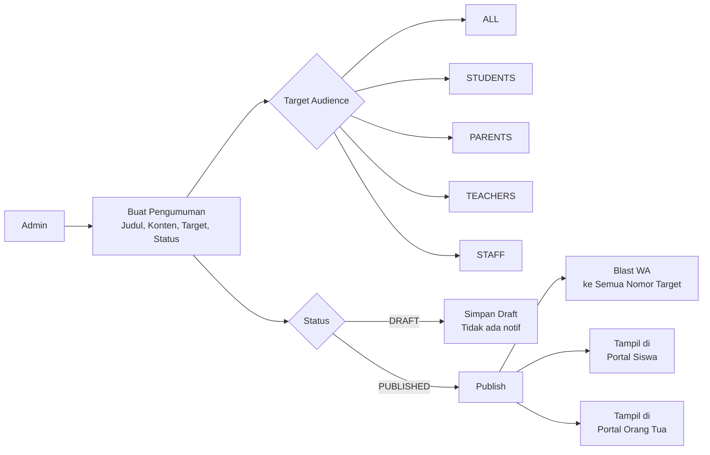
```mermaid
flowchart LR
    ADMIN[Admin] --> BUAT[Buat Pengumuman\nJudul, Konten, Target, Status]
    BUAT --> TARGET{Target Audience}
    TARGET --> ALL[ALL]
    TARGET --> STUDENTS[STUDENTS]
    TARGET --> PARENTS[PARENTS]
    TARGET --> TEACHERS[TEACHERS]
    TARGET --> STAFF[STAFF]

    BUAT --> STATUS{Status}
    STATUS -- DRAFT --> SIMPAN_DRAFT[Simpan Draft\nTidak ada notif]
    STATUS -- PUBLISHED --> SIMPAN_PUB[Publish]
    SIMPAN_PUB --> WA_BLAST[Blast WA\nke Semua Nomor Target]

    SIMPAN_PUB --> PORTAL_SISWA[Tampil di\nPortal Siswa]
    SIMPAN_PUB --> PORTAL_ORTU[Tampil di\nPortal Orang Tua]
```

---

## 18. Flow Kepegawaian & Guru

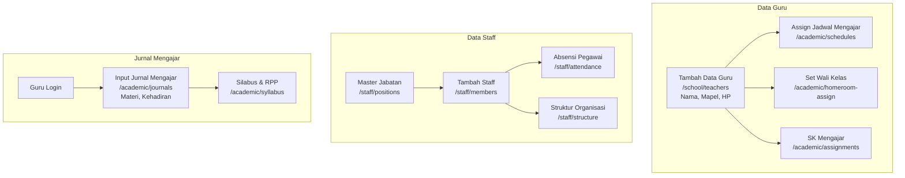
```mermaid
flowchart TD
    subgraph GURU_FLOW["Data Guru"]
        TAMBAH_GURU[Tambah Data Guru\n/school/teachers\nNama, Mapel, HP]
        TAMBAH_GURU --> ASSIGN_JADWAL[Assign Jadwal Mengajar\n/academic/schedules]
        TAMBAH_GURU --> ASSIGN_WALI[Set Wali Kelas\n/academic/homeroom-assign]
        TAMBAH_GURU --> SK[SK Mengajar\n/academic/assignments]
    end

    subgraph STAFF_FLOW["Data Staff"]
        JABATAN[Master Jabatan\n/staff/positions]
        JABATAN --> TAMBAH_STAFF[Tambah Staff\n/staff/members]
        TAMBAH_STAFF --> ABSENSI_STAFF[Absensi Pegawai\n/staff/attendance]
        TAMBAH_STAFF --> STRUKTUR[Struktur Organisasi\n/staff/structure]
    end

    subgraph JURNAL["Jurnal Mengajar"]
        GURU_LOGIN[Guru Login] --> JURNAL_INPUT[Input Jurnal Mengajar\n/academic/journals\nMateri, Kehadiran]
        JURNAL_INPUT --> SILABUS[Silabus & RPP\n/academic/syllabus]
    end
```

---

## 19. Flow Poskestren (Kesehatan)

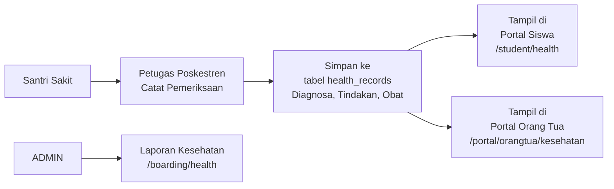
```mermaid
flowchart LR
    SANTRI_SAKIT[Santri Sakit] --> PERIKSA[Petugas Poskestren\nCatat Pemeriksaan]
    PERIKSA --> DB_HEALTH[Simpan ke\ntabel health_records\nDiagnosa, Tindakan, Obat]
    DB_HEALTH --> PORTAL_SISWA[Tampil di\nPortal Siswa\n/student/health]
    DB_HEALTH --> PORTAL_ORTU[Tampil di\nPortal Orang Tua\n/portal/orangtua/kesehatan]
    ADMIN --> LAPORAN_SEHAT[Laporan Kesehatan\n/boarding/health]
```

---

## 20. Flow Pengaturan Sistem

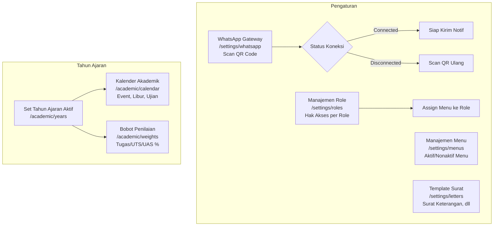
```mermaid
flowchart TD
    subgraph SETTINGS["Pengaturan"]
        WA_SETUP[WhatsApp Gateway\n/settings/whatsapp\nScan QR Code]
        WA_SETUP --> WA_STATUS{Status Koneksi}
        WA_STATUS -- Connected --> WA_READY[Siap Kirim Notif]
        WA_STATUS -- Disconnected --> WA_SCAN[Scan QR Ulang]

        MENU_MGR[Manajemen Menu\n/settings/menus\nAktif/Nonaktif Menu]
        ROLE_MGR[Manajemen Role\n/settings/roles\nHak Akses per Role]
        ROLE_MGR --> ROLE_MENU[Assign Menu ke Role]

        LETTER[Template Surat\n/settings/letters\nSurat Keterangan, dll]
    end

    subgraph TAHUN_AJARAN["Tahun Ajaran"]
        TA[Set Tahun Ajaran Aktif\n/academic/years]
        TA --> KALENDER[Kalender Akademik\n/academic/calendar\nEvent, Libur, Ujian]
        TA --> BOBOT[Bobot Penilaian\n/academic/weights\nTugas/UTS/UAS %]
    end
```

---

## 21. Flow Data Siswa

```mermaid
flowchart TD
    ADMIN[Admin] --> TAMBAH[Tambah Siswa Manual\nNIS, NISN, Nama, Gender,\nTTL, Kelas, Asrama,\nData Ayah/Ibu/Wali]
    TAMBAH --> DB_STU[Simpan ke tabel students]

    ADMIN --> IMPORT[Import Massal via CSV\nFormat: NIS,NISN,Nama,L/P,\nTempat Lahir,Tgl Lahir,Alamat]
    IMPORT --> CEK_NIS{NIS Duplikat?}
    CEK_NIS -- Ya --> SKIP[Lewati baris]
    CEK_NIS -- Tidak --> DB_STU

    ADMIN --> EDIT[Edit Data Siswa\n20 field lengkap]
    EDIT --> UBAH_STATUS{Ubah Status?}
    UBAH_STATUS --> ACTIVE[ACTIVE]
    UBAH_STATUS --> GRADUATED[GRADUATED - Lulus]
    UBAH_STATUS --> MOVED[MOVED - Pindah]
    UBAH_STATUS --> DROPPED[DROPPED - DO]

    ADMIN --> EXPORT[Export Excel\nFilter Kelas & Status]
    ADMIN --> DETAIL[Halaman Detail Profil\nNilai, Absensi, Tagihan,\nPelanggaran dalam 1 halaman]
    ADMIN --> CETAK[Cetak Biodata PDF]
    ADMIN --> HAPUS[Hapus Siswa]
```

---

## 22. Flow Data Wali Murid

```mermaid
flowchart LR
    ADMIN[Admin] --> LIST[Daftar Wali Murid\n/student-affairs/parents\nData dari tabel students]
    LIST --> EDIT[Edit Data Orang Tua\nAyah: Nama, Pekerjaan, HP\nIbu: Nama, Pekerjaan, HP\nWali: Nama, Hubungan, HP, Alamat]
    EDIT --> UPDATE[Update tabel students\nkolom father_*, mother_*, guardian_*]
    UPDATE --> NOTIF_WA[Nomor HP digunakan\nuntuk Notifikasi WA Otomatis]
```

---

## 23. Flow Jadwal Pelajaran (Admin)

```mermaid
flowchart TD
    PREREQ[Prasyarat:\nTahun Ajaran Aktif\nKelas, Mata Pelajaran,\nGuru sudah ada]
    PREREQ --> BUAT[Buat Jadwal\n/academic/schedules\nKelas, Mapel, Guru,\nHari, Jam Mulai, Jam Selesai]
    BUAT --> DB_SCH[Simpan ke tabel schedules]
    DB_SCH --> PORTAL_SISWA[Tampil di Portal Siswa\n/student/schedule]
    DB_SCH --> PORTAL_ORTU[Tampil di Portal Orang Tua\n/portal/orangtua/jadwal]
    DB_SCH --> INPUT_NILAI[Digunakan saat\nInput Nilai Guru]
    DB_SCH --> JURNAL[Digunakan saat\nJurnal Mengajar]
```

---

## 24. Flow Jurnal Mengajar

```mermaid
flowchart LR
    GURU[Guru] --> PILIH_JADWAL[Pilih Jadwal\n/academic/journals]
    PILIH_JADWAL --> ISI[Isi Jurnal:\nMateri, Metode,\nKehadiran Siswa]
    ISI --> DB_JURNAL[Simpan ke\ntabel teaching_journals]
    DB_JURNAL --> REKAP[Admin Lihat\nRekap Jurnal per Guru]
```

---

## 25. Flow Bank Soal

```mermaid
flowchart LR
    GURU[Guru] --> UPLOAD[Upload Soal\n/academic/exams\nJudul, Mata Pelajaran,\nTipe, File PDF/DOC]
    UPLOAD --> DB_EXAM[Simpan ke\ntabel exam_banks\nFile di /uploads/exams/]
    DB_EXAM --> DOWNLOAD[Admin/Guru\nDownload Soal]
    DB_EXAM --> FILTER[Filter: Mapel, Tipe\nUTS/UAS/Harian]
```

---

## 26. Flow Kenaikan Kelas

```mermaid
flowchart TD
    ADMIN[Admin] --> PILIH[Pilih Kelas Asal\n/academic/promotion]
    PILIH --> LIST_SISWA[Tampil Daftar Siswa\ndi Kelas Tersebut]
    LIST_SISWA --> PILIH_AKSI{Pilih Aksi}
    PILIH_AKSI -- Naik Kelas --> PILIH_TUJUAN[Pilih Kelas Tujuan]
    PILIH_TUJUAN --> UPDATE_KELAS[Update classroom_id\nSemua Siswa Dipilih]
    PILIH_AKSI -- Luluskan --> GRADUATED[Update status = GRADUATED\nclassroom_id = NULL]
    GRADUATED --> AUTO_ALUMNI[Auto tambah ke tabel alumni\nJika belum ada]
```

---

## 27. Flow Dispensasi KBM

```mermaid
flowchart LR
    ADMIN[Admin/Guru] --> AJUKAN[Catat Dispensasi\n/academic/kbm-permits\nSiswa, Tipe, Tanggal, Alasan]
    AJUKAN --> DB_PERMIT[Simpan ke kbm_permits\nStatus: APPROVED]
    DB_PERMIT --> SYNC_ABS{Ada record\nAbsensi di tgl ini?}
    SYNC_ABS -- Ya --> UPDATE_ABS[Update status Absensi\nA → I atau S]
    SYNC_ABS -- Tidak --> CREATE_ABS[Buat record Absensi baru\nStatus I atau S]
    UPDATE_ABS & CREATE_ABS --> DONE[Absensi tersinkronisasi\nSiswa tidak dihitung Alfa]
    ADMIN --> DELETE[Hapus Dispensasi]
```

---

## 28. Flow Silabus & RPP

```mermaid
flowchart LR
    GURU[Guru] --> UPLOAD[Upload Silabus/RPP\n/academic/syllabus\nMapel, Kelas, File]
    UPLOAD --> DB_SYL[Simpan ke\ntabel syllabus_documents\nFile di /uploads/syllabus/]
    DB_SYL --> DOWNLOAD[Admin/Guru\nDownload Dokumen]
    DB_SYL --> FILTER[Filter per\nMapel & Kelas]
```

---

## 29. Flow Kurikulum

```mermaid
flowchart LR
    ADMIN[Admin] --> BUAT[Buat Kurikulum\n/academic/curriculum\nNama, Tahun, Deskripsi]
    BUAT --> DB_CUR[Simpan ke\ntabel curriculums]
    DB_CUR --> ASSIGN[Assign Kurikulum\nke Mata Pelajaran]
```

---

## 30. Flow SK Mengajar

```mermaid
flowchart LR
    ADMIN[Admin] --> BUAT_SK[Buat SK Mengajar\n/academic/assignments\nGuru, Mapel, Kelas,\nTahun Ajaran]
    BUAT_SK --> DB_SK[Simpan ke\ntabel teaching_assignments]
    DB_SK --> CETAK[Cetak SK\nFormat PDF/Print]
```

---

## 31. Flow Kalender Akademik

```mermaid
flowchart TD
    ADMIN[Admin] --> TAMBAH[Tambah Event\n/academic/calendar\nJudul, Tgl Mulai, Tgl Selesai,\nTipe, Warna]
    TAMBAH --> DB_CAL[Simpan ke\ntabel academic_calendar\nper Tahun Ajaran Aktif]
    DB_CAL --> TAMPIL[Tampil di Kalender\nAdmin & Portal Siswa]
    DB_CAL --> CETAK[Cetak Kalender\nper Bulan/Tahun]
    ADMIN --> EDIT_CAL[Edit / Hapus Event]
```

---

## 32. Flow Jenis Tagihan & Data SPP

```mermaid
flowchart LR
    ADMIN[Admin] --> MASTER[Buat Jenis Tagihan\n/finance/fee-types\nNama, Nominal, Tipe]
    MASTER --> DB_FT[Simpan ke fee_types]
    DB_FT --> BILLING[Muncul di Dropdown\nForm Buat Tagihan\n/finance/billing]
    DB_FT --> AUTO_NOMINAL[Nominal Terisi\nOtomatis saat Dipilih]

    ADMIN --> SPP[Data SPP\n/finance/spp\nKhusus Jenis MONTHLY\nNama SPP, Nominal]
    SPP --> DB_SPP[Simpan ke fee_types\ntype = MONTHLY]
    DB_SPP --> BILLING
```

---

## 33. Flow Laporan Bendahara

```mermaid
flowchart TD
    ADMIN[Admin/Bendahara] --> PILIH_BULAN[Pilih Bulan & Tahun\nFlatpickr Month Picker]
    PILIH_BULAN --> LOAD[Load Data]
    LOAD --> RINGKASAN[Kartu Ringkasan:\nPemasukan Bulan Ini\nTotal Tunggakan\nJumlah Transaksi]
    LOAD --> PER_JENIS[Tabel Pemasukan\nper Jenis Tagihan]
    LOAD --> TUNGGAKAN[Tabel Tunggakan\nper Jenis Tagihan]
    LOAD --> PER_KELAS[Rekap per Kelas:\nSudah Bayar vs Belum]
    LOAD --> RECENT[20 Transaksi\nTerbaru Bulan Ini]

    ADMIN --> BLAST_WA[Blast WA Tagihan\nFilter per Kelas]
    BLAST_WA --> ORTU_UNPAID[Kirim ke Semua Orang Tua\nyang Masih Punya Tunggakan]

    ADMIN --> CETAK[Cetak Laporan\nwindow.print]
```

---

## 34. Flow Alumni

```mermaid
flowchart LR
    ADMIN[Admin] --> TAMBAH[Tambah Alumni\n/school/alumni\nNIS, Nama, Tahun Lulus,\nAktivitas, HP, Email]
    TAMBAH --> DB_ALU[Simpan ke\ntabel alumni]
    DB_ALU --> FILTER[Filter: Tahun Lulus,\nAktivitas Setelah Lulus]
    DB_ALU --> CETAK_SURAT[Cetak Surat\nKeterangan Alumni\nReplace placeholder otomatis]
    ADMIN --> EDIT_ALU[Edit / Hapus Data Alumni]
```

---

## 35. Flow Tiket Bantuan (Support)

```mermaid
flowchart TD
    USER[Pengguna\nSiswa/Guru/Staff] --> BUAT[Buat Tiket\n/support\nSubjek, Kategori, Pesan]
    BUAT --> DB_TKT[Simpan ke tabel tickets\nStatus: OPEN]
    DB_TKT --> ADMIN_VIEW[Admin Lihat\nSemua Tiket]
    ADMIN_VIEW --> BALAS[Admin Balas\nPesan]
    BALAS --> STATUS_ANS[Status: ANSWERED]
    STATUS_ANS --> USER_BALAS[User Balas Lagi]
    USER_BALAS --> STATUS_OPEN[Status: OPEN kembali]

    USER --> LIHAT_SENDIRI[User hanya lihat\nTiket Milik Sendiri]
    ADMIN --> LIHAT_SEMUA[Admin lihat\nSemua Tiket]
```

---

## 36. Flow Template Surat

```mermaid
flowchart LR
    ADMIN[Admin] --> BUAT_TPL[Buat Template\n/settings/letters\nKode, Nama, Konten HTML\ndengan Placeholder:\n{nama} {nis} {kelas}\n{tempat_lahir} {tgl_lahir} {alamat}]
    BUAT_TPL --> DB_TPL[Simpan ke\ntabel letter_templates]
    DB_TPL --> CETAK[Cetak Surat\n/settings/letters/print\n?template_id=X&student_id=Y]
    CETAK --> REPLACE[Replace Placeholder\ndengan Data Siswa]
    REPLACE --> PDF[Render Halaman A4\nSiap Cetak]
```

---

## 37. Flow Kelas Saya (Portal Wali Kelas)

```mermaid
flowchart TD
    GURU[Guru yang Ditunjuk\nsebagai Wali Kelas] --> CEK{Terdaftar sebagai\nWali Kelas?}
    CEK -- Tidak --> EMPTY[Halaman Kosong\nInfo belum ditugaskan]
    CEK -- Ya --> DASHBOARD[Dashboard Wali Kelas\n/homeroom\nInfo Kelas: Total Siswa,\nL/P, Pelanggaran, Absensi]
    DASHBOARD --> LIST_SISWA[Daftar Siswa Perwalian\nTotal Pelanggaran & Absensi]
    DASHBOARD --> LAPORAN[Laporan Wali Kelas\n/homeroom/report-all\nFilter per Kelas & Level]
    LAPORAN --> CETAK_REKAP[Cetak Rekapitulasi:\nAbsensi S/I/A per Siswa\nTotal Poin Pelanggaran]
```

---

## 38. Flow Pelacakan Santri

```mermaid
flowchart LR
    ADMIN[Admin/Guru] --> CATAT[Catat Aktivitas Santri\n/discipline/tracking\nSiswa, Tipe Aktivitas,\nLokasi, Deskripsi, Waktu]
    CATAT --> DB_LOG[Simpan ke\ntabel student_activity_logs]
    DB_LOG --> FILTER[Filter per Tanggal\ndan Nama Siswa]
    DB_LOG --> REKAP[Rekap Aktivitas\nHarian Santri]
    ADMIN --> EDIT_LOG[Edit / Hapus Log]
```
